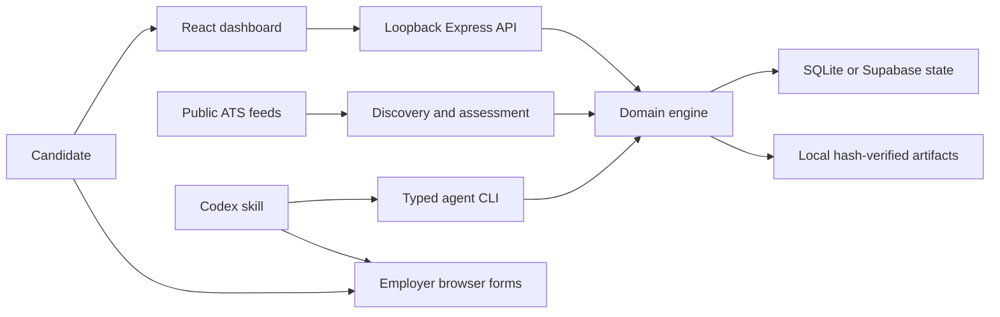

<div align="center">

# Career Agent

### A local-first job application workspace.

Research opportunities. Prepare with facts. Review every application.

[](https://github.com/AdiRosenstock/career-agent-public/actions/workflows/ci.yml)


[](LICENSE)

[Get started](#quick-start) · [Use with Codex](docs/CODEX_SETUP.md) · [Architecture](docs/ARCHITECTURE.md) · [Design decisions](docs/DESIGN_DECISIONS.md) · [Interface](docs/UI_DESIGN.md)

</div>

---

Career Agent is my local-first application workspace, built around a simple requirement: reduce repetitive application work while keeping the candidate in control. It brings job research, sourced facts, unchanged documents, draft answers, duplicate checks, and review history into one place.

The dashboard is the system of record. Codex handles research and browser work through a repository skill. An application is only considered submitted when there is confirmation evidence.

**Project by [Adi Rosenstock](https://github.com/AdiRosenstock).** Built with TypeScript, React, Express, SQLite, and a Codex workflow. This repository contains reusable code and synthetic examples; personal applications and documents belong in each user's private workspace.


> **Current scope:** US full-time 2027 graduate and early-career roles across product, data, software, finance, and consulting. It is a single-user local application, not a hosted multi-user service. Other countries, cohorts, and independent background workers need further development.

## What you can do

| Capability | How it works |
|---|---|
| Discover opportunities | Read public Greenhouse, Lever, and Ashby job feeds; import sourced manual postings |
| Keep a factual profile | Save confirmed experience and exact reusable answers with provenance |
| Compare compensation | Check annual USD base or total pay against your selected floor; keep ambiguous ranges in research |
| Research sponsorship | Separate role-specific policy from employer history and explicit refusals |
| Avoid duplicate applications | Match prior evidence by ATS identity, URL, requisition, and role; hold uncertain identities for review |
| Prepare review packets | Track tailored answers, open questions, document choices, and content versions |
| Preserve original documents | Copy PDFs without rewriting them and verify SHA-256 before use |
| Fill with human review | Use Codex browser tools or the optional basic-field helper; keep final submission under your control |
| Track outcomes | Keep handoffs, failures, confirmed submissions, and unknown outcomes distinct |

The app does not run an invisible AI agent, store email credentials, take candidate assessments, bypass CAPTCHA, or guarantee compatibility with every employer form. A ready packet is not proof that a live form is complete.

## Quick start

### Requirements

- Node.js **22.16+** and npm. Node 22 is the tested/CI baseline; `.nvmrc` selects it. Use the same Node runtime for installation and execution.
- Git and an unchanged résumé PDF available locally.
- Codex for the agent workflow. Manual tracking and the local dashboard can run without it.
- Internet access for dependency installation and employer feeds.

```sh
git clone https://github.com/AdiRosenstock/career-agent-public.git
cd career-agent-public
# If you use nvm: nvm install && nvm use
npm ci
cp .env.example .env.local
```

Edit `.env.local` and add the absolute path to **your own** résumé:

```dotenv
CAREER_BACKEND=sqlite
CAREER_RESUME_PATH=/absolute/path/to/your-resume.pdf
PORT=4317
```

Then:

```sh
npm run build
npm start
```

Open **[127.0.0.1:4317](http://127.0.0.1:4317)**. A new workspace starts with a blank candidate profile. Open **Your profile** to save contact details, verified facts, work authorization, and reusable answers. Set your compensation minimum and base/total basis in **Settings**. Do not copy another candidate's profile or legal declarations.

The server uses `.data/career-agent.sqlite` by default. Files and credentials remain private in `.data/` and `.env.local`; they are excluded from Git. Existing databases remain authoritative when you update the code.

### Try the interface with fictional data

```sh
npm run demo
```

Open **[127.0.0.1:4318](http://127.0.0.1:4318)**. The demo uses its own `.data/demo` SQLite database, a fictional candidate, reserved example URLs, and a placeholder PDF. It never loads your normal application database. Demo jobs intentionally lack verified sponsorship and stay in research. **Do not upload the demo PDF or use its fictional facts in an application.** Stop it with Ctrl+C.

## Use with Codex

Open this cloned repository as a local Codex project. It includes `AGENTS.md` and a discoverable skill at `.agents/skills/job-application-agent/SKILL.md`. Start with:

```text
Use $job-application-agent in this repository. Check my saved profile and
application history, then help prepare US full-time 2027 graduate roles.
Follow my current role priorities and compensation settings. Preserve my
original PDFs. Ask only for missing facts and leave employer forms ready
for my review. Do not submit or start an automation.
```

Read the [complete Codex setup guide](docs/CODEX_SETUP.md) for onboarding, account coverage, form filling, and reusable prompts. Browser and email tools depend on your Codex installation and permissions; the dashboard does not provide them itself.

## Your daily workflow

1. **Confirm your profile.** Store only facts and exact answers you have verified.
2. **Check previous applications.** Inspect actual receipts or candidate-account status; alerts are not submissions.
3. **Discover and research.** Refresh public feeds or import a posting. Verify cohort, employment type, compensation, and sponsorship.
4. **Prepare a packet.** Inspect the actual hosted form and resolve required answers and upload choices.
5. **Review.** Check the packet and live form. Submit yourself by default. Explicit agent submission also requires a current dashboard-approved packet and a request to execute that batch.
6. **Record the result.** Save actual confirmation evidence. An uncertain result must be reconciled before retrying.

Ordinary new preparation is capped at **20/day**, shared across runs using the Chicago day boundary. Explicit one-day manual allowances can raise the limit to 50; they do not authorize submission. Scheduling is separate, opt-in Codex configuration. A stored automation identifier is not proof that a scheduler is running.

## Architecture at a glance



The engine owns eligibility, packet versions, approvals, daily limits, and attempt transitions. Browser interactions happen outside the engine; confirmation evidence connects them back to history. SQLite transactions or Supabase revision checks coordinate updates. A selected backend failing never silently redirects writes elsewhere.

See [architecture](docs/ARCHITECTURE.md) and [design decisions](docs/DESIGN_DECISIONS.md) for the data model, trust boundaries, and tradeoffs.

## Documentation

| Guide | Covers |
|---|---|
| [Codex setup](docs/CODEX_SETUP.md) | First-run onboarding, profile facts, account checks, browser workflow, prompts |
| [Architecture](docs/ARCHITECTURE.md) | Components, state, approval integrity, concurrency, trust boundaries |
| [Design decisions](docs/DESIGN_DECISIONS.md) | Why local first, explicit evidence, hash-verified documents, and human review |
| [Interface design](docs/UI_DESIGN.md) | Layout, visual hierarchy, filter behavior and accessibility |
| [Configuration and storage](docs/CONFIGURATION.md) | Environment variables, SQLite/Supabase, backups, restore and migration |
| [CLI reference](docs/CLI.md) | Commands, side effects, structured payloads |
| [Troubleshooting](docs/TROUBLESHOOTING.md) | Startup, PDFs, browser persistence, ATS limitations |
| [Browser helper](browser-extension/README.md) | Optional Chrome/Edge extension installation and limits |
| [Contributing](CONTRIBUTING.md) | Development, validation, privacy and pull requests |
| [Security](SECURITY.md) | Local-only deployment and private vulnerability reporting |

## Development

```sh
npm ci
npm test
npm run build
npm run check:public
npm run dev
```

Tests use temporary storage and fictional fixtures; they do not apply to real employers. CI runs public-file hygiene, tests, and the production build on Node 22. `npm run check:public` checks tracked files for common private artifacts and credential patterns; it is not a complete secret scanner or Git-history audit.

## Before deleting a workspace

A GitHub clone restores **code**, not your candidate state. Back up the active state **and** local artifacts to private storage, verify a restore into an empty destination, and retain any original documents you need. Exported JSON does not include PDF bytes. Never publish application histories, exported answers, candidate documents, cookies, credentials, or private handoffs.

## License

[MIT](LICENSE). You can use, modify, and share the code subject to the license. Employer sites retain their own terms; this project grants no permission to bypass their controls.
