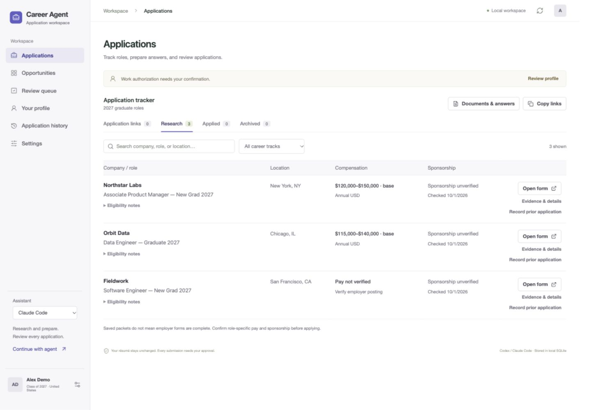
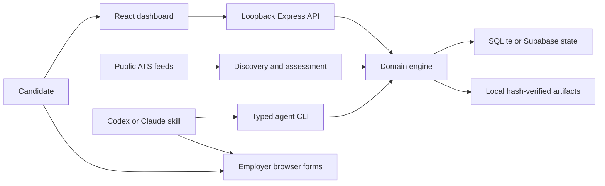

<div align="center">

# Career Agent

### A local-first job application workspace.

Research opportunities. Prepare with facts. Review every application.

[](https://github.com/AdiRosenstock/career-agent-public/actions/workflows/ci.yml)


[](LICENSE)

[Get started](#quick-start) · [Use with Codex or Claude](docs/AGENT_SETUP.md) · [Architecture](docs/ARCHITECTURE.md) · [Design decisions](docs/DESIGN_DECISIONS.md) · [Interface](docs/UI_DESIGN.md)

</div>

---

## Let Codex or Claude Code set it up

Already have Codex or Claude Code? **Copy this entire prompt into its chat.** It asks your assistant to install and run the app, then guide you through your own profile. You do not need to understand the commands first. Your assistant may need permission to install software or access a local file.

```text
Install and set up Career Agent on my computer:
https://github.com/AdiRosenstock/career-agent-public

Do the setup work, not just explain it. Check my operating system and existing
Git and Node installations. Use Node 22 (at least 22.16) for installation and
execution. If a prerequisite is missing, help install it from its official
source, respecting any required permissions.

Clone the repository into a suitable local folder, or reuse an existing
checkout without overwriting changes. Read README.md, AGENTS.md, and CLAUDE.md
when applicable. Run npm ci. Preserve any existing .env.local, database,
documents, and storage choice.

For a new workspace, ask me for the full path to my original résumé PDF.
Use local SQLite unless I request another backend. Run setup with
npm run setup -- --resume "FULL_PATH_TO_MY_PDF" --backend sqlite
using the actual path I provide, not the placeholder. Do not rewrite my PDF.
If I do not have it ready, start the fictional demo with npm run demo instead,
and explain how to finish personal setup later.

Build with npm run build, run npm run doctor, and fix setup errors.
Start npm start for my personal workspace and check that the dashboard loads
at http://127.0.0.1:4317 (the demo uses http://127.0.0.1:4318).
If a port is occupied, identify the existing service instead of killing it.
Keep the app running and tell me how to stop and reopen it.

Walk me through Your profile and Settings. Explain that automatic preparation
currently supports US full-time roles for a June 2027 graduation; do not assume
that is my graduation date. Show me company, sponsorship and pay filters.

Help me choose Codex or Claude Code in the dashboard. Explain what browser
and email tools I need for assisted work, and guide me through connecting my
own tools only when I request it. The dashboard's assistant selector does not
connect accounts. Do not ask me to paste secrets into chat or tracked files.

Do not submit applications, send messages, start automations, publish my
personal data, or invent profile answers. End with the working local URL,
what was installed, and any genuinely unfinished setup steps.
```

Prefer doing it yourself? Follow the [step-by-step quick start](#quick-start) below. To try fictional data first, tell your assistant: **“Set up the demo only; do not ask for my résumé yet.”**

Career Agent is an open-source, local-first application workspace, built around a simple requirement: reduce repetitive application work while keeping the candidate in control. It brings job research, sourced facts, unchanged documents, draft answers, duplicate checks, and review history into one place.

The dashboard is the system of record. Codex or Claude Code handles research and browser work through a repository skill. An application is only considered submitted when there is confirmation evidence.

**Open source under the MIT license.** Built with TypeScript, React, Express, SQLite, and a shared agent workflow. This repository contains reusable code and synthetic examples; personal applications and documents belong in each user's private workspace.



> **Current scope:** US full-time 2027 graduate and early-career roles across product, data, software, finance, and consulting. It is a single-user local application, not a hosted multi-user service. Other countries, cohorts, and independent background workers need further development.

## What you can do

| Capability | How it works |
|---|---|
| Filter saved roles | Company, location, sponsorship evidence, compensation, career track, and status; built-in quick views and sorting |
| Discover opportunities | Read public Greenhouse, Lever, and Ashby job feeds; import sourced manual postings |
| Keep a factual profile | Save confirmed experience and exact reusable answers with provenance |
| Compare compensation | Check annual USD base or total pay against your selected floor; keep ambiguous ranges in research |
| Research sponsorship | Separate role-specific policy from employer history and explicit refusals |
| Avoid duplicate applications | Match prior evidence by ATS identity, URL, requisition, and role; hold uncertain identities for review |
| Prepare review packets | Track tailored answers, open questions, document choices, and content versions |
| Preserve original documents | Copy PDFs without rewriting them and verify SHA-256 before use |
| Fill with human review | Use your agent’s browser tools or the optional basic-field helper; keep final submission under your control |
| Track outcomes | Keep handoffs, failures, confirmed submissions, and unknown outcomes distinct |

The app does not run an invisible AI agent, store email credentials, take candidate assessments, bypass CAPTCHA, or guarantee compatibility with every employer form. A ready packet is not proof that a live form is complete.

## Quick start

You run Career Agent on **your own computer**. There is no website account to create. Your profile and documents stay in your private workspace. The dashboard works for manual tracking; Codex or Claude Code adds research and form-filling assistance.

**Current limitation:** automatic preparation supports US full-time roles for a **June 2027 graduation**. Other graduation dates need manual review and changes to the matching rules. This is not yet a general-purpose application service for every candidate.

### 1. Install the basics once

- Install **Node.js 22** from [Node.js](https://nodejs.org/en/download). Node runs the app; npm, included with it, installs its dependencies. The project is tested on Node 22.16 or newer within Node 22.
- Install [Git](https://git-scm.com/downloads), which downloads and updates the project.
- For assisted work, use your installed **Codex or Claude Code**. You can try the dashboard without either.

Open **Terminal** on macOS or **PowerShell** on Windows. Paste each command below and press Enter. Keep this terminal open while using the app.

### 2. Download Career Agent

```sh
git clone https://github.com/AdiRosenstock/career-agent-public.git
cd career-agent-public
npm ci
```

Wait for installation to finish. The `career-agent-public` folder is your copy of the app. Keep it in a place you can find again.

### 3. Try it first, with fictional data

```sh
npm run demo
```

Open [the demo at 127.0.0.1:4318](http://127.0.0.1:4318) in your browser. Try the company, sponsorship, location, pay and career-track filters. **About** in the left menu introduces the creator. The demo uses fictional jobs and a placeholder résumé; do not use them for real applications. It never loads your personal application database.

Press **Ctrl+C** in the terminal to stop the demo when you are ready for your own workspace.

### 4. Set up your own workspace

Have your original résumé PDF ready. In the same project folder, run:

```sh
npm run setup
npm run doctor
npm run build
npm start
```

During setup:

1. Enter the full path to your résumé PDF, including the filename. On macOS you can copy a file's path from Finder. Use the original PDF; setup will not rewrite it.
2. Choose **SQLite** for the easiest start. SQLite is a database stored on your computer and needs no account or server setup.
3. Keep the suggested port, **4317**, unless another app already uses it.

`doctor` checks your setup and reports missing requirements. On the first run it may report that the app has not been built; the next command, `npm run build`, handles that. Fix any Node, résumé or database errors before continuing. Setup will not overwrite an existing configuration.

Open [your dashboard at 127.0.0.1:4317](http://127.0.0.1:4317). This address works only while the app is running on your computer.

- **Your profile:** enter your own contact details, graduation date, verified experience and exact reusable answers. Confirm work authorization yourself.
- **Settings:** choose role priorities, a compensation minimum, and whether the minimum means base salary or total compensation.
- **Applications:** filter saved roles and review the evidence. Employer sponsorship history is not confirmation for a specific role.
- **Opportunities:** add a job posting or refresh configured public employer feeds. An empty list is normal until jobs are imported or feeds are configured.
- **About:** find the creator's background, LinkedIn, GitHub and source links. You can reopen it directly with `?view=about`.

Your private files live in `.data/` and `.env.local`. They are excluded from Git. **GitHub stores the code, not your application records.** Keep a private backup if you need to restore your history later.

### 5. Use Codex or Claude Code

Open the `career-agent-public` folder in Codex, or open your installed Claude Code session in that folder. In the dashboard's left panel, choose your assistant and click **Continue with agent**. Copy the instruction into that assistant's chat.

Selecting an assistant does **not** connect an account or start an agent. Both assistants read the repository's project instructions and shared application skill. Browser and email access must be provided by your own agent tools or MCP servers. An MCP server is a tool connection that lets your assistant use a service; none is needed merely to track jobs locally.

For a first request, paste:

```text
Use the job-application-agent skill in this repository. Check my saved profile
and application history. Help prepare jobs that match my preferences.
Preserve my original documents. Ask for missing facts instead of guessing.
Leave employer forms ready for my review. Do not submit or start automations.
```

If browser or email tools are unavailable, use manual tracking and have the assistant prepare answers for you to copy. A saved packet is not proof that an employer form has been filled.

See [agent setup](docs/AGENT_SETUP.md) for the exact Codex and Claude instructions. Use [connections](docs/CONNECTIONS.md) if you want your own Supabase database or browser/email MCP tools. Supabase is optional; beginners should start with SQLite.

### Open the app again later

Open a terminal inside your `career-agent-public` folder and run:

```sh
npm start
```

Open [127.0.0.1:4317](http://127.0.0.1:4317). Your saved local records remain between runs. Stop the app with **Ctrl+C**; this does not erase your data. You do not need to run setup again.

### If something goes wrong

| What you see | What to do |
|---|---|
| `npm` or `node` is not recognized | Install Node 22, then close and reopen your terminal |
| `package.json` cannot be found | Enter the downloaded folder with `cd career-agent-public` |
| Browser says the page is unavailable | Run `npm start` and keep the terminal open; use port 4317 for your workspace or 4318 for the demo |
| Native SQLite / Node version error | Use Node 22 for both installation and execution, then run `npm ci` again |
| Résumé path or checksum error | Run `npm run doctor`; restore the original PDF rather than editing the recorded checksum |
| Setup says configuration already exists | Keep it; do not delete your configuration to repeat onboarding |
| No jobs or no sponsorship matches | Import a posting or configure feeds; unknown evidence does not count as confirmed sponsorship |
| Your assistant cannot open forms | Configure its browser tools or fill manually; see the connections guide |

For more help, read [troubleshooting](docs/TROUBLESHOOTING.md). When reporting an issue, remove personal answers, documents and credentials from logs or screenshots.

## Your daily workflow

1. **Confirm your profile.** Store only facts and exact answers you have verified.
2. **Check previous applications.** Inspect actual receipts or candidate-account status; alerts are not submissions.
3. **Discover and research.** Refresh public feeds or import a posting. Verify cohort, employment type, compensation, and sponsorship.
4. **Prepare a packet.** Inspect the actual hosted form and resolve required answers and upload choices.
5. **Review.** Check the packet and live form. Submit yourself by default. Explicit agent submission also requires a current dashboard-approved packet and a request to execute that batch.
6. **Record the result.** Save actual confirmation evidence. An uncertain result must be reconciled before retrying.

Ordinary new preparation is capped at **20/day**, shared across runs using the Chicago day boundary. Explicit one-day manual allowances can raise the limit to 50; they do not authorize submission. Scheduling is separate, opt-in agent/host configuration. A stored automation identifier is not proof that a scheduler is running.

## Architecture at a glance



The engine owns eligibility, packet versions, approvals, daily limits, and attempt transitions. Browser interactions happen outside the engine; confirmation evidence connects them back to history. SQLite transactions or Supabase revision checks coordinate updates. A selected backend failing never silently redirects writes elsewhere.

See [architecture](docs/ARCHITECTURE.md) and [design decisions](docs/DESIGN_DECISIONS.md) for the data model, trust boundaries, and tradeoffs.

## Documentation

| Guide | Covers |
|---|---|
| [Agent setup](docs/AGENT_SETUP.md) | First-run onboarding, profile facts, account checks, browser workflow, prompts |
| [Connections](docs/CONNECTIONS.md) | Your own database, agent accounts, browser/email tools and MCP servers |
| [Architecture](docs/ARCHITECTURE.md) | Components, state, approval integrity, concurrency, trust boundaries |
| [Design decisions](docs/DESIGN_DECISIONS.md) | Why local first, explicit evidence, hash-verified documents, and human review |
| [Interface design](docs/UI_DESIGN.md) | Layout, visual hierarchy, filter behavior and accessibility |
| [Configuration and storage](docs/CONFIGURATION.md) | Environment variables, SQLite/Supabase, backups, restore and migration |
| [CLI reference](docs/CLI.md) | Commands, side effects, structured payloads |
| [Troubleshooting](docs/TROUBLESHOOTING.md) | Startup, PDFs, browser persistence, ATS limitations |
| [Browser helper](browser-extension/README.md) | Optional Chrome/Edge extension installation and limits |
| [Contributing](CONTRIBUTING.md) | Development, validation, privacy and pull requests |
| [Security](SECURITY.md) | Local-only deployment and private vulnerability reporting |

## Development

```sh
npm ci
npm test
npm run build
npm run check:public
npm run dev
```

Tests use temporary storage and fictional fixtures; they do not apply to real employers. CI runs public-file hygiene, tests, and the production build on Node 22. `npm run check:public` checks tracked files for common private artifacts and credential patterns; it is not a complete secret scanner or Git-history audit.

## Before deleting a workspace

A GitHub clone restores **code**, not your candidate state. Back up the active state **and** local artifacts to private storage, verify a restore into an empty destination, and retain any original documents you need. Exported JSON does not include PDF bytes. Never publish application histories, exported answers, candidate documents, cookies, credentials, or private handoffs.

## License

[MIT](LICENSE). You can use, modify, and share the code subject to the license. Employer sites retain their own terms; this project grants no permission to bypass their controls.

## About the creator


Career Agent was created by **Adi Rosenstock**, a Costa Rican student studying Data Science and Economics at Northwestern University and the creator of [BanterBoost](https://fplbanterboost.com). It grew out of a personal application workflow and is open source so others can use their own documents, profile, storage, and agent tools.

The architecture keeps candidate data private, checks original document integrity, shares one workflow across Codex and Claude Code, and requires current approval before submission. Read the [architecture decisions](docs/ARCHITECTURE.md) for implementation details.

[LinkedIn](https://www.linkedin.com/in/adirosenstock) · [GitHub](https://github.com/AdiRosenstock)

Biography and portrait: [BanterBoost About page](https://fplbanterboost.com/about). The portrait is hosted there and is not covered by this repository's software license. Creator attribution does not supply application answers or identify the current workspace user.
