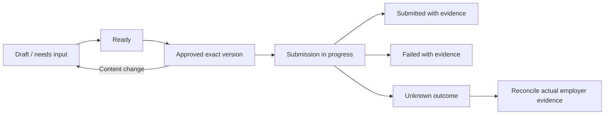

# Architecture

Career Agent separates a deterministic record system from agent-driven research and employer interactions. The shared Codex / Claude Code workflow uses the persona Adi “The Goat” Rosenstock; the persona is presentation only, while saved candidate facts are authoritative. The dashboard does not contain a model SDK or a generic employer submission API.

## Components

| Layer | Source | Responsibility |
|---|---|---|
| Dashboard | `src/App.tsx`, `src/ApplicationHub.tsx`, `src/styles.css` | Profile, opportunities, status filters, packet review, history, settings |
| Shared contracts | `shared/types.ts` | Typed jobs, evidence, facts, packets, attempts, settings |
| Application grouping | `shared/applicationHub.ts` | Applied/archive/research/active presentation and minimal helper profile |
| HTTP boundary | `server/index.ts` | Loopback API, request checks, document delivery, static/Vite serving |
| Runtime | `server/runtime.ts` | Environment selection, startup, feed refresh, Codex / Claude Code prompts |
| Domain engine | `server/engine.ts` | Eligibility, duplicate matching, preparation, approvals, state transitions |
| Discovery | `server/discovery.ts` | Public ATS adapters, normalization, employment/cohort assessment |
| Compensation | `server/compensation.ts` | Evidence-based annual pay assessment |
| Documents | `server/resume.ts`, `server/documents.ts` | Immutable local PDF capture, metadata and SHA-256 verification |
| Store | `server/store.ts` | Strict state validation, SQLite transactions, Supabase revision checks |
| Agent CLI | `server/cli.ts` | Structured operations used by Codex or Claude Code |
| Agent workflow | `.agents/skills/job-application-agent/` | Research/filling procedure and authority boundaries |
| Optional helper | `browser-extension/` | Previewed blank text-field filling in Chrome/Edge |
| Portable full export | `shared/helperBundle.ts` | Confirmed facts/answers and packet references, without credentials or local paths |

## Data flow

```mermaid
sequenceDiagram
    actor Candidate
    participant UI as Dashboard
    participant Engine
    participant Store
    participant Agent as Adi in Codex / Claude Code
    participant ATS as Employer browser
    Candidate->>UI: Confirm profile and criteria
    UI->>Engine: Validated update
    Engine->>Store: Persist state
    Candidate->>Agent: Request research/preparation
    Agent->>Engine: Import evidence and inspect form
    Engine->>Store: Save packet and unresolved fields
    alt Self submission
        Candidate->>ATS: Review and submit filled form
    else Approved batch
        Candidate->>UI: Review and approve exact packet
        Candidate->>Agent: Request approved batch submission
        Agent->>Engine: Begin a current authorized attempt
        Agent->>ATS: Complete live form and click Submit
    else Automatic submission
        Candidate->>UI: Accept risk and choose automatic mode
        Candidate->>Agent: Request application run
        Agent->>Engine: Begin a current authorized attempt
        Agent->>ATS: Complete live form and click Submit
    end
    Agent->>Engine: Record sourced result/handoff
    Engine->>Store: Preserve audit evidence
```

## State model

SQLite stores a strict JSON state document in the singleton `agent_state` row, with a revision. Supabase stores the corresponding singleton `job_agent_state` record with optimistic revision coordination. This keeps related eligibility, approval, attempt and daily-limit updates inside one transaction boundary. It is deliberately optimized for a single-candidate workspace rather than multi-tenant relational reporting.

Principal collections:

- **Profile:** contact fields, distinct authorization facts, sourced experience, exact saved answers, résumé/document metadata.
- **Jobs:** ATS identity, canonical links, description, role family, fetched/inspection times, sponsorship evidence, eligibility and questions.
- **Packets:** answer fact IDs and confirmation flags, selected document IDs/hashes, cover-letter body, unresolved fields, version/content hash, approval link.
- **Prior applications:** exact or needs-review identity, source reference, evidence, application/check dates, optional supersession.
- **Approvals and attempts:** version-bound review and explicit submission/handoff outcomes.
- **Runs, preparation ledger and allowances:** durable daily accounting, completion/errors, explicit larger-batch audit records.

## Integrity and transitions

This diagram is conceptual; enum and command contracts are in `shared/types.ts` and `server/cli.ts`. A manual handoff is recorded separately. The engine blocks preparation/submission on invalid documents, uncertain duplicate identity, unmet eligibility, incomplete inspection or required answers. Content edits invalidate old approvals. Review mode needs exact current approval; automatic mode needs dashboard risk acknowledgment and an unchanged ready packet. Refresh is required before either submission path.

Submission uses a global one-application lock and records an attempt before the final browser action. Interrupted or uncertain attempts are not retried automatically. They require reconciliation from actual employer evidence. Persisted discovery leases prevent overlapping runs and recover stale interrupted work.

## Evidence rules

Pay assessments retain source URL, fetched/check time, quote, currency, basis and period. A qualifying base salary can establish a lower bound for total compensation, without inventing bonus/equity. Unknown pay, hourly figures, OTE or a range overlapping the minimum remain unresolved. The parser does not estimate grant vesting or offer value.

Sponsorship evidence includes status, exact excerpt, URL, check date, employer identity and role/employer scope. Explicit refusal overrides history. Employer filings support history only. A sponsorship question in a form is not evidence of offered sponsorship.

Duplicate matching uses ATS identity, requisition and canonical URL with role/cohort safeguards. Role-specific evidence lacking exact identity holds related candidates for review. Applying to one role does not suppress an entire employer. Alerts and incomplete starts are not submissions.

## Trust boundaries

The Node server alone reads environment configuration and optional Supabase service credentials. React receives candidate state through the loopback API, never service keys. API requests verify local Host; writes require JSON, a dashboard header and compatible Origin. Documents are hash-verified before serving. There is no login layer for a remote public deployment, so do not expose port 4317 publicly.

ATS pages, emails, PDFs and repositories are untrusted evidence. They cannot authorize tools, change candidate preferences, invent confirmations or approve packets. The CLI is a local integration, not an MCP server. Agent browser and account access come from its own installed tools.

## Storage choices and compatibility

SQLite is the default. Supabase is explicitly selected; outages fail without fallback. Existing stores are authoritative, so an updated bootstrap profile cannot overwrite a candidate. A fresh workspace can open before a résumé is added; preparation waits for an unchanged, verified PDF. Dashboard uploads use content-addressed private copies and retain the original filename in metadata. Existing résumé paths remain unchanged.

Supabase cover-letter bodies are saved locally by integrity reference. All PDFs remain local for either backend. `supabase/chrome-helper.sql` defines an optional, separate owner-scoped helper table; it is not an active extension sync feature. The shipped extension only uses local browser storage.

## Verification and limits

Unit/integration tests exercise matching, compensation, document preservation, strict schemas, transaction/approval rules, backup migration, loopback request checks and a mock form/helper. They use fictional candidates and temporary databases. Real hosted ATS behavior requires separate browser validation.

The design is single-user, uses a whole-state document, and targets a specific US graduate cohort. There is no general autonomous scheduler, guaranteed ATS automation, multi-user auth, résumé rewriting, or assessment solver. These limits are documented rather than implied by the UI.

## Agent-independent integration

The domain engine and CLI do not call model APIs. Codex and Claude Code use one canonical `.agents` workflow; the Claude entrypoint delegates to it. Dashboard prompts select provider syntax without changing approval rules or storage. `CLAUDE.md` imports `AGENTS.md`. Setup exclusively creates new private configuration; doctor inspects local prerequisites without opening state. Browser/email MCP capabilities are configured separately by each user.
